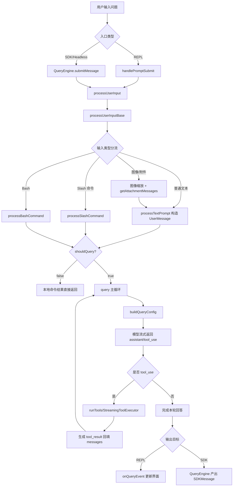

# 从用户输入问题到模型回答：核心调用链路分析

> 本文基于当前仓库代码梳理主链路（REPL 交互模式 + SDK/Headless 模式），聚焦“用户输入一个问题后，系统如何处理并得到模型回答”。

## 1) 入口层：接收用户输入

### REPL（CLI 交互）入口
- 用户在终端输入后，会进入 `handlePromptSubmit`，它负责：
  - 构建 `ProcessUserInputContext`
  - 调用 `processUserInput(...)`
  - 若 `shouldQuery=true`，再调用 `onQuery(...)` 进入模型查询循环。  
- 关键文件/函数：
  - `src/utils/handlePromptSubmit.ts` → `handlePromptSubmit(...)`
  - `src/screens/REPL.tsx` → `onQuery(...)` 内部 `for await (const event of query(...))`

### SDK/Headless 入口
- SDK 路径由 `QueryEngine.submitMessage(...)` 负责单轮提交：
  - 先调用 `processUserInput(...)` 规范化输入
  - 再调用 `query(...)` 执行主循环并流式产出消息。
- 关键文件/函数：
  - `src/QueryEngine.ts` → `QueryEngine.submitMessage(...)`

---

## 2) 输入预处理层：`processUserInput`

`processUserInput(...)` 是“用户输入 → 可送入模型的消息列表”的统一入口，主要流程：

1. 调用 `processUserInputBase(...)` 做输入分流与解析。  
2. 执行 `UserPromptSubmit hooks`（可阻断继续查询）。
3. 返回：
   - `messages`（用户消息 + 附件 + 系统消息等）
   - `shouldQuery`（是否需要真正调用模型）
   - 可选 `allowedTools/model/effort/resultText`。

关键文件/函数：
- `src/utils/processUserInput/processUserInput.ts`
  - `processUserInput(...)`
  - `processUserInputBase(...)`

---

## 3) 输入分流层：普通问题 / Slash 命令 / Bash / 图像

`processUserInputBase(...)` 中的分流逻辑：

- **图像输入处理**：`maybeResizeAndDownsampleImageBlock(...)`，并注入 image metadata。
- **附件提取**：`getAttachmentMessages(...)`（IDE 选区、上下文附件等）。
- **Bash 模式**：走 `processBashCommand(...)`。
- **Slash 命令**：走 `processSlashCommand(...)`。
- **普通文本问题**：走 `processTextPrompt(...)`。

关键文件/函数：
- `src/utils/processUserInput/processUserInput.ts`
- `src/utils/processUserInput/processTextPrompt.ts` → `processTextPrompt(...)`

---

## 4) 消息构造层：把用户问题转成消息对象

普通文本问题最终在 `processTextPrompt(...)` 里生成 `UserMessage`：
- 生成 `promptId`
- 记录 telemetry / analytics
- 将文本、图像、附件组合成标准消息数组
- 返回 `shouldQuery: true`（即要进入模型查询）

关键文件/函数：
- `src/utils/processUserInput/processTextPrompt.ts`

---

## 5) 查询执行层：`query(...)` 主循环

`query(...)` 是“模型采样 + 工具调用 + 再采样”的核心状态机：

1. `buildQueryConfig()` 生成本轮配置。
2. 进入 streaming 循环，持续接收模型事件（assistant 内容、tool_use 等）。
3. 如果出现 `tool_use`：
   - 通过 `runTools(...)`/`StreamingToolExecutor` 执行工具
   - 产出 `tool_result` 再喂回消息序列。
4. 根据停止条件（无 tool_use、达到 turn 限制、异常/中断等）退出。

关键文件/函数：
- `src/query.ts`
  - `query(...)`
  - `queryLoop(...)`
- `src/query/config.ts` → `buildQueryConfig(...)`
- `src/services/tools/toolOrchestration.ts` → `runTools(...)`

---

## 6) 输出回传层：把模型回答流式显示/返回

### REPL 路径
- `REPL.tsx` 中通过 `for await (const event of query(...))` 消费流式事件。
- 每个事件由 `onQueryEvent(...)` 等逻辑更新 UI 与消息历史。

### SDK 路径
- `QueryEngine.submitMessage(...)` 迭代 `query(...)` 的输出并转成 `SDKMessage`。
- 同时进行 transcript 记录、usage 汇总、结果消息封装。

关键文件/函数：
- `src/screens/REPL.tsx`
- `src/QueryEngine.ts`

---

## 7) 端到端流程图（Mermaid）

---

## 8) 关键文件速查（按调用顺序）

1. `src/utils/handlePromptSubmit.ts`（REPL 输入入口）
2. `src/QueryEngine.ts`（SDK/Headless 输入入口）
3. `src/utils/processUserInput/processUserInput.ts`（输入总处理）
4. `src/utils/processUserInput/processTextPrompt.ts`（普通文本消息构造）
5. `src/query.ts`（模型与工具主循环）
6. `src/query/config.ts`（查询配置）
7. `src/services/tools/toolOrchestration.ts`（工具执行编排）
8. `src/screens/REPL.tsx`（REPL 流式消费与渲染）

